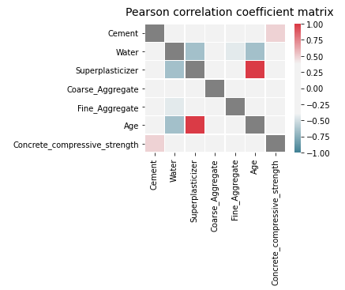
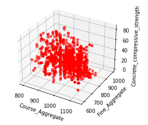

# Concrete_Strength_Prediction
Prediction of Concrete Compressive Strength using Regression Model
# Dataset Description
Dataset is available at UCI repository for link [click here](https://archive.ics.uci.edu/ml/datasets/concrete+compressive+strength)   
Dataset features include:
* Cement: The amount of cement added per kilogram in a meter cube mixture. The data is quantitative in nature and fulfils the input requirement.
* Water: The amount of water added per kilogram in a meter cube mixture. The data is quantitative in nature and fulfils the input requirement.
* Superplasticizer: The amount of superplasticizer added per kilogram in a meter cube mixture. The data is quantitative in nature and fulfils the input requirement.
* Coarse Aggregate: The amount of Coarse Aggregate added per kilogram in a meter cube mixture. The data is quantitative in nature and fulfils the input requirement.
* Fine Aggregate: The amount of Fine Aggregate added per kilogram in a meter cube mixture. The data is quantitative in nature and fulfils the input requirement.
* Age: This is given in days, from 1 to 365 days. The data is quantitative in nature and fulfils the input requirement.
* CSS: This is given in MPa, and it is quantitative in nature, but it fulfils the output requirement.
# EDA (Expolaratory Data Analysis)
## Correlation Matrix
  
## 3D Scatter Plot

# Regression Model Used
Multiple LR (Multiple Linear Regression)
# Tools used
* Jupyter Notebook
* Orange Tool
* Notebook Markdown
* Python libraries (Scikit-learn, Seaborn, Matplotlib, Pandas, Numpy etc.)
